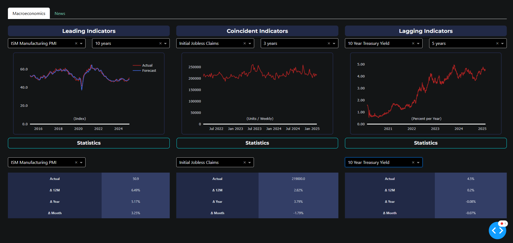
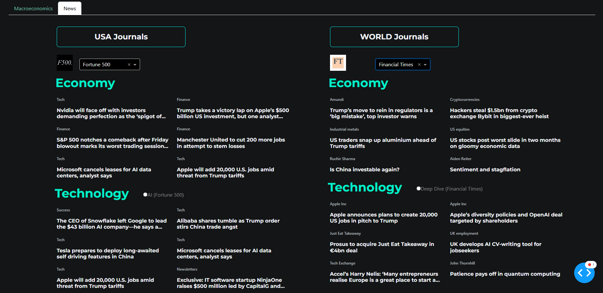

# Financial Market Dashboard

## Project Description

This project provides an interactive dashboard for visualizing and analyzing key financial market indicators. The dashboard leverages Python and various libraries to fetch, process, and display real-time and historical data related to US Economic performance, market trends and business news.

This project showcases skills in data collection, web development, and data visualization, making it an ideal demonstration of technical and analytical capabilities in building robust tools for real-time information aggregation.

## Macroeconomics Tab

The **Macroeconomics Indicator Tab** is a web-based application designed to gather and display US economic trends from multiple sources in an organized, user-friendly interface. By leveraging API, data-gathering and data-cleaning techniques, this project collects data on themes such as PMI, Consumer Sentiment, Initial Jobless Claims, Nonfarm Payroll, PPI, Feds Fund Rate, etc. The data is presented in a structured and visually appealing manner using Python's Dash framework.

1. **Data Integration**:
   - Retrieves and integrates data from various sources, including CSV files, Web-Scraping and external APIs (Fred).

2. **Interactive Visualizations**:
   - Generates dynamic charts and graphs to visualize trends, correlations, and anomalies in the financial data.
   - Allows users to filter, sort, and customize the displayed data based on the indicator and time frame.
  
3. **Data-Driven Insights**:
   - Provides users with a comprehensive overview of the current market conditions and potential trends.
   - Organizes financial indicators into three categories: Leading Indicators, Coincident Indicators, and Lagging Indicators, allowing for a structured analysis of economic health.
  
4. **Statistics View**:
   - Enables users to visualize and analyze time series data for selected indicators, including historical trends and forecasts.
   - Displays key statistics for each indicator, including actual values, year-over-year (YoY) change, and month-over-month (MoM) change.



## News Tab

The **News Aggregator Tab** is a web-based application designed to gather and display news articles from multiple sources in an organized, user-friendly interface. By leveraging web scraping techniques, this project collects articles on themes such as technology and economy from a variety of international news outlets. The data is presented in a structured and visually appealing manner using Python's Dash framework.

1. **Automated News Collection**:
   - The application scrapes news articles from prominent sources like CNN, CNBC, Financial Times, and more.
   - Themes include economy, technology, artificial intelligence, and deep-dive analysis.

2. **Centralized Dashboard**:
   - News articles are displayed in a well-structured dashboard using Dash and Dash Bootstrap Components.
   - The layout includes distinct sections for U.S.-based and international news, ensuring comprehensive coverage.

3. **Efficient Scraping Implementation**:
   - Utilizes Selenium WebDriver with Beautiful Soup for dynamic and static content extraction.
   - Stores aggregated news data in a CSV file (`news.csv`) for easy accessibility and further analysis.

4. **Responsive and User-Friendly Design**:
   - Built using Dash Bootstrap Components, the dashboard is optimized for different screen sizes and provides a seamless user experience.
  


## Technologies Used

- **Python**:
  - Core language for scripting and development.
  - Libraries: Selenium, Beautiful Soup, Pandas, Dash, Plotly, Dash Bootstrap Components.
- **Vizualizing Tools**:
   - Plotly library for interactive graphing.  
- **Web Scraping Tools**:
  - Selenium WebDriver for handling dynamic web pages.
  - Beautiful Soup for HTML parsing.
- **Data Storage**:
  - Aggregated data stored in `.csv` for modularity and reusability.
- **Web Framework**:
  - Dash for creating interactive web applications.

## How It Works

1. **Data Collection**:

   - The `data_fred.py` and `data_ism_pmi.py` script contains specialized functions to scrape data from:
     - Federal Reserve Economic Data (FRED)
     - Investing.com
   - The `data_news.py` script contains specialized functions to scrape articles from:
     - CNN
     - CNBC
     - Financial Times
     - China Daily
     - Valor Internacional
     - Fortune
   - Each function handles a specific source and theme.

3. **Data Integration**:
   - The `get_{indicator}()` and `webscraping_ism_pmi()` functions consolidates the collected data into multiples DataFrames.
   - The `scraping_news()` function consolidates the collected data into a single DataFrame.
   - The data is saved in `.csv` for dashboard consumption.

5. **Dashboard Visualization**:
   - The `dashboard.py` script builds the interactive dashboard.

## Key Highlights

- **End-to-End Development**: Demonstrates ability to design, develop, and deploy a functional application.
- **Web Scraping Expertise**: Extracts structured data from diverse sources efficiently.
- **Data Visualization Skills**: Creates an intuitive user interface with Dash for real-time insights.
- **Modular Design**: Ensures maintainability and scalability with clear separation of concerns.

## How to Run

1. **Install Dependencies**:
   - Download the Repository:
     ```bash
     git clone <repository_url>
     cd <repository_name>
     ```
   - Create a Virtual Environment:
     ```bash
      python -m venv venv
      venv\Scripts\activate
     ```
   - Install Dependencies:
     ```bash
      pip install -r requirements.txt
     ```
   - Set Up the .env File:
     ```bash
      pip install python-dotenv
     ```     
2. **Run the Scraping Script**:
   - Execute `routine.py` to collect the latest data and articles every day or execute each one of these files:
     ```bash
     python data_news.py
     python data_fred.py
     python data_ism_pmi.py
     ```

3. **Launch the Dashboard**:
   - Start the dashboard server with `dashboard.py`:
     ```bash
     python dashboard.py
     ```

4. **View the Application**:
   - Open a web browser and navigate to `http://localhost:8051`.

---
